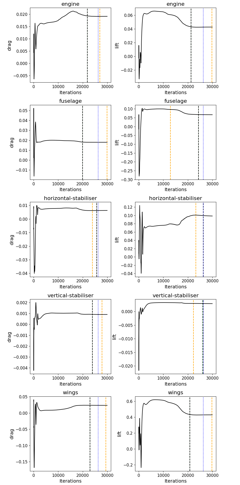

## Introduction

pyCFD-OSC (Python Computational Fluid Dynamics - Optimal Stopping Criterion) is a package to post-process an existing simulation to extract the best stopping criterion. It minimises the number of iterations that need to be run to achieve a desired accuracy, and provides output that can be used in the CFD set up.

Stopping a CFD simulation is historically done based on residuals. Once these have _converged_ sufficiently, the simulation is deemed to be complete. However, this is not always the best approach. The residuals are not always the best indicator of the accuracy of the simulation.

Nowadays, it is much more common to define a integral quantity-based convergence control strategy. These integral coefficients are typically the lift or drag coefficient. Once these coefficients are converged, the simulation is deemed to be complete. However, using integral quantities requires user-defined inputs for which there is no clear guidance on how to define them.

Even worse, depending on these user-defined inputs, the solution can converge either prematurely or much beyond a point where there is no change in the simulation anymore. Thus, determining these inputs to stop the simulation at the point where the simulation does no longer change is challenging. 

This package takes a simulation that has already been performed, and post-processes the history of integral quantities such as the lift and drag coefficients. It then determines what the best stopping criterion would have been for this simulaton. This can then be used to achieve a similar convergence for similar simulations (i.e. for parametric studies).

## Installation

Download or clone this repository. You wil need a working installation of python 3 and its package manager pip. Then, install the required packages by running:

```pip install -r requirements.txt```

This will install matplotlib, in case it is not already on your machine. This package is used to generate the plots that show the optimal stopping criterion.

See the [Example use cases](#example-use-cases) section for examples on how to run this package.

## Code execution and file structure

This package is written in Python. The entry point is the pycfd-osc.py file. This file requires a number of command line arguments, all of which can be displayed by running ```python3 pycfd-osc.py --help```. At a minimum, the case name is required, which is provided with the ```--case``` or ```-c``` argument.

### Specifying the case name

The package expects a case folder within the ```input/``` folder. The case folder name must be the same name as specified by the ```-c``` argument. Within the case folder, a new folder must be created for each boundary patch on which a integral quantity is recorded. And, for each boundary patch folder, there must be additional folders for each integral quantity that is recorded. Within the integral quantity folder, a file must exist that represents the iteration history of the integral quantity for that boundary patch. Currently, only files created by ANSYS Fluent are supported, but additional file readers are on the todo list.

For example, the file ```input/car/floor/lift/lift-history.dat``` would present the iteration history of the lift coefficient on the floor of a car simulation. If the drag was also to be recorded, the file ```input/car/floor/drag/drag-history.dat``` would be required. The actual file name of the integral quantity does not matter here; it can have any name. Two examples are provided in the ```input/``` folder to demonstrate the expected file structure.

The first example is for a simplified F1 front wing assembly. It provides the lift and drag (in Newtons) for the entire front wing assembly. Thus, within the ```input/frontWing/``` folder, there are two folders: ```lift/``` and ```drag/```.

The second example is that of the Saab 340 aircraft. It provides lift and drag coefficients on five different boundary patches, namely the engine (cover), fuselage, wing, horizontal stabiliser, and vertical stabiliser. Thus, within the ```input/saab340/``` folder, there are five folders: ```engine/```, ```fuselage/```, ```wing/```, ```horizontalStabiliser/```, and ```verticalStabiliser/```. Each of these folders contains a ```lift/``` and ```drag/``` folder.

### Specifying the window size

Next, we can optionally specify the window sizes to check. The window size (an integer number) is the number of iterations to use to average the integral quantitites (e.g. the lift and drag coefficient). A window size of 10 means we average over 10 iterations to get an average lift and drag coefficient, for example.

We specify the minimum and maximum window size to check, as well as the increments between windows. The defaults are:
- min window size: 10
- max window size: 100
- window size increment: 5

These can be changed by using the ```--window-size``` or ```-w``` argument. For example, to check window sizes from 50 to 500, with increments of 10, we would run:

```python3 pycfd-osc.py -c frontWing -w 50 500 10```

### Specifying the asymptotic convergence threshold

The first step in determinign whether a simulation has converged, is to calculate what the asymptotic value is for each integral quantity (e.g. the lift and drag coefficient). This is done by looking at the last few values of the integral quantity and averaging them over the smallest window size. This will give us a mean value of the integral quantity that will be expected at the end of the simulation.

Then, this package determines at which point we are within a certain threshold of this asymptotic value. This threshold is specified by the ```--asymptotic-convergence-threshold``` or ```-act``` argument. The default is 0.01, which means that the average coefficient must be within 1% of the asymptotic value to be considered converged. This can be changed by running:

```python3 pycfd-osc.py -c frontWing -act 0.05```

In this case, we have a 5% threshold. Increasing this value will lead to a earlier stopping criterion. 

## Example use cases

To test the package, you can run one of the provided test cases. The first is integrated lift and drag data on a generic F1 front wing assembly, while the second is a simulation around the Saab 340 aircraft. The test cases are run by executing the following commands:

```python3 pycfd-osc.py -c frontWing```

or

```python3 pycfd-osc.py -c saab340```

You can change the window size and asymptotic convergence threshold as discussed above.

## Expected output

The output is placed within the ```output``` folder. Two files will be generated. The first is a plot of each integral quantity for each boundary patch. It contains a few vertical lines. These have the following definition:

- The orange dashed line represents the point at which monotonic convergence is reached. After this point, the slope of the residuals does not change, i.e. the slope will remain either positive or negative. This is a strict, and perhaps conservative, stopping criterion. An optimal iteration to stop may be found before this point (see definition for the green line below). Though, ideally, we would like the line to appear first, and all other lines (disussed below) to appear after this line. This is not always possible, and if the orange line appears much closer to the end of the simulation, it may indicate that not enough iterations were used to run this simulation.
- The green dashed line indicates the point at which the average coefficient (based on the smallest window size) will have an error that is less than the specified asymptotic convergene threshold, compared to the average at the end of the simulation (the asymptotic value). This line should be seen as the earliest possible stopping criterion.
- The black dashed lines shows the point at which an optimal stopping criterion has been found for each integral quantity. It is determined by finding the window size that produces a certain residual at or past the green line (optimal iteration to stop). This residual becomes the stopping criterion we have to impose in our simulation, i.e. it will be the convergence threshold. Quite often, you will see the green and black line overlapping, so if the green line is not visible, we have found a stopping criterion that is close to the earliest possible stopping criterion.
- The blue dotted line represents the optimal iteration to stop for all coefficients and boundary patches. It is simply the largest optimal iteration to stop across coefficients and boundary patches (indicated by the black dashed line). Thus, for at least one coefficient, the black dashed line and blue dotted line will overlap.

An example for the Saab 340 simulation is given below:



In addition, a ```<case-name>_windowed_data.json``` file will be reated, which summarises the required window size and convergence threshold that should be used for the specified integral quantity and boundary patch to achieve the best stopping criterion for this simulation. It also prints information on whether convergence was reached prematurely or not. This file can be used to set up the simulation for future runs.

## How to use your own cases

If you want to use this package for your own case, you will first have to create a simulation in which you write out integral quantities (e.g. lift, drag, momentum coefficient, wall shear stresses, or other integral (scalar) quantities you can record over iteration).

Then, you have to create the same folder structure within the ```input/``` folder, as discussed above for the example cases, i.e. create a case folder first, and within the case folder, create folders for each boundary patch, and within each boundary patch folder, create folders for each integral quantity. Then, place the iteration history file in the integral quantity folder.

Finally, run the package with the case name as argument, and optionally specify the window size and asymptotic convergence threshold.